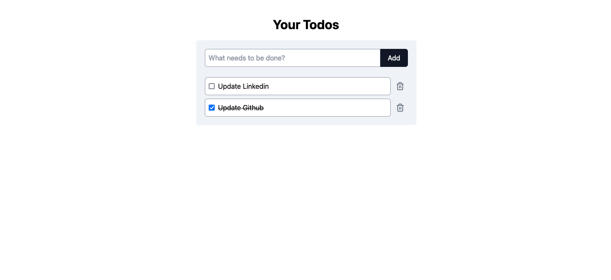

# Simple Todo List App

A straightforward todo list application built with React and styled using Tailwind CSS.

The "Hello, world!" of web dev. This project was created a while back as a learning exercise to practice React and Tailwind CSS. I'm sharing it to document my learning journey and contribute to my GitHub portfolio. The app is simple but functional, demonstrating basic React concepts and Tailwind CSS styling.



## Features

- Add new tasks
- Mark tasks as complete
- Delete tasks

## Technologies Used

- React
- Tailwind CSS

## Installation

1. Clone the repository:

```
git clone https://github.com/MoAlkhateeb/simple-react-todo.git
```


2. Navigate to the project directory:

```
cd simple-react-todo
```

3. Install dependencies:

```
npm install
```

4. Start the development server:

```
npm run dev
```

## License

[MIT](https://choosealicense.com/licenses/mit/)